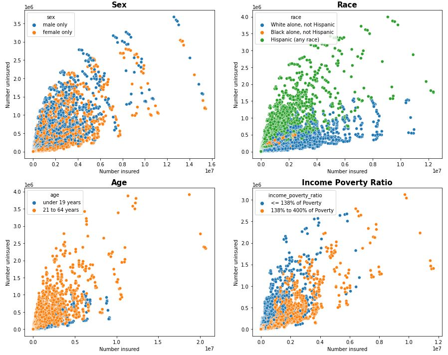

# Observation on Uninsured Rates in the U.S.

>  Subtitle: Which group of people are not likely to be insured?
>  
>  Author: Seyoung Jung

### __Introduction:__
According to [The American Journal of Medicine](https://www.amjmed.com/article/S0002-9343%2809%2900525-7/fulltext), "health care expenses were the most common cause of bankruptcy in the United States in 2007, accounting for 62% of US bankruptcies compared with 8% in 1981." The journal also states that millions of citizens do not have health insurance due to expensive insurance costs. In other words, the insurance system in the United States can be considered as a failure, and it is a serious social problem. Therefore, the system should be further developed by the government. In order to develop the system, one needs to identify which groups of people are less likely to be insured compared to other groups. After identifying them, they should customize insurance programs for the vulnerable groups. 
This project investigates various features, such as age groups, ethnicity, sex, income poverty ratio, etc, from 2010 to 2018. Based on the features, this project explores how they are related to their possibility of being insured, by performing descriptive analysis and exploratory data analysis. And lastly, this project identifies particularly which group of people are unlikely to be insured. 

### __Directory:__
In order to see the process of this project with explanations and interpretations, please see the jupyter notebook file, named "health_insurance_notebook" in this repository. If you want to see code only, please see the the "health_insurance_code" file. 

### __About the Data:__ 
The dataset used for this project was obtained from the [United States Census Bureau](https://www.census.gov/data/developers/data-sets/Health-Insurance-Statistics.html). In order to access to the data and reproduce this analysis, one needs to have their own API keys. You can directly request a key by singing up on this [page](https://api.census.gov/data/key_signup.html). This dataset was collected through the "Small Area Health Insurance Estimates (SAHIE)" program. You can find more information about the program [here](https://www.census.gov/programs-surveys/sahie.html). 

### __Instruction:__
After obtaining your own API keys, you can insert the keys into "api_keys" variable inside the code file or jupyter notebook. The variable is placed in the beginning of the file/notebook. 

### __Methods:__

This project uses the following methods to accomplish the goal:
- __Data Extraction__: request the values for the parameters from 2010 to 2018 from the united States Census Bureau
- __Data Preprocessing__: transform the dataframes and write the resulting dataframes to a single table in the SQLite database
- __Data Retrieval__: retrieve necessary data from the database using SQL queries
- __Descriptive Analysis__: summarize the historical data
- __Exploratory Data Analysis__: explore the data and find patterns within the data through visualizing features

### __Conclusion:__

This project explores various features such as age group, sex, income poverty ratio, ethnicity, etc. And we observe that among the features, income poverty ratio, state, and ethnicity particularly play big roles influencing the uninsured ratio. The uninsured ratio is high when the income poverty ratio is low. And among all the ethnicity groups, Hispanics have the highest uninsured ratio. Also, Georgia has the highest uninsured ratio in the United States.

Through this context, one can conclude that the Hispanics in Georgia with low income poverty ratio do not have enough opportunity to have health insurance. Therefore, the state of Georgia can benchmark existing laws or programs regarding health insurance currently being used in states with low uninsured ratio, and try to give a more suitable opportunity to those uninsured people. By reducing the uninsured ratio in the United States, we could potentially reduce the number of bankrupcies occurred due to health care costs.
